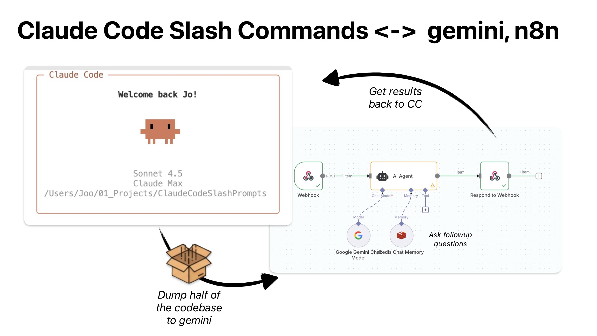

# Claude Code Slash Command Templates

## What This Repository Provides

This repository contains **3 ready-to-use prompt templates** that help you create custom slash commands for Claude Code. Each template is a complete prompt you can customize and paste into Claude Code to generate working integrations.

**The three templates:**

1. **Gemini via Google API** - Analyze your codebase using Google's Gemini AI directly
2. **Gemini via n8n** - Route AI analysis through your n8n automation workflows
3. **Generic n8n Webhook** - Connect any n8n workflow to Claude Code as a slash command

---

## What Are Slash Commands?

Slash commands are shortcuts you create for Claude Code. You write a simple markdown file that tells Claude Code what to do when you type `/your-command`.

For example:
- Type `/gemini-analyze src/` → Claude collects your source files and sends them to Gemini AI for analysis
- Type `/deploy staging` → Claude triggers your deployment workflow via n8n
- Type `/quality-check` → Claude runs your tests and posts results to Slack

**How they work:**
- You create two files: a command definition (`.md`) and a shell script (`.sh`)
- The markdown file describes the command and its arguments
- The shell script does the actual work (API calls, file collection, etc.)
- Files go in `~/.claude/commands/` and `~/.claude/scripts/`

**Slash commands vs MCP servers:**
- **Slash commands** are local shell scripts. Simple, fast, you control them completely.
- **MCP servers** are background processes that extend Claude's capabilities. More powerful but more complex.

Use slash commands for repetitive tasks you want to automate.

---



---

## Usage Examples

**Analyze your codebase:**
```bash
/gemini-analyze src/components 2 session1 -- Review the React components for common issues
/gemini-ask session1 -- What security concerns do you see?
```

**Trigger a deployment:**
```bash
/deploy staging -- Deploy latest changes to staging environment
```

**Run quality checks:**
```bash
/quality-check src/ -- Run linting and tests, post results to Slack
```

**Generate documentation:**
```bash
/gen-docs src/api -- Extract JSDoc comments and generate markdown docs
```

---

## How to Use These Templates

Each template is a complete prompt with placeholders like `[YOUR_API_KEY]`. Here's how to use them:

1. **Choose a template** from the list below
2. **Open the template file** in your editor
3. **Replace all placeholders** with your actual values (API keys, webhook URLs, etc.)
4. **Copy the entire file** - the whole file is the prompt
5. **Paste into Claude Code** - Claude will read it and implement the commands for you
6. **Use your new command** - type `/gemini-analyze` or whatever command was created

That's it. Claude generates the command files and scripts automatically.

---

## The Templates

### 1. Gemini via Google API
→ [claude_code_gemini_google_api_integration_template.md](./claude_code_gemini_google_api_integration_template.md)

Connects Claude Code directly to Google's Gemini API. Analyze large codebases with AI.

**Creates:**
- `/gemini-analyze` - Analyze files and store context for follow-up questions
- `/gemini-ask` - Ask follow-up questions without re-sending files

**You need:**
- Google Gemini API key (free tier available)

**Costs:**
- ~$0.01-0.05 for small projects (~50 files)
- ~$0.10-0.25 for medium projects (~200 files)
- ~$0.001 for follow-up questions (context already stored)

---

### 2. Gemini via n8n Webhook
→ [claude_code_gemini_n8n_integration_template.md](./claude_code_gemini_n8n_integration_template.md)

Routes AI analysis through your n8n workflows. Combine AI analysis with automation (Slack notifications, GitHub integration, database storage, etc.).

**Creates:**
- `/gemini-analyze` - Send files to n8n for AI analysis
- `/gemini-ask` - Follow-up questions (n8n stores the context)

**You need:**
- n8n instance (cloud or self-hosted)
- n8n workflow with webhook that forwards to Gemini API

**Good for:**
- Teams already using n8n
- When you need to combine AI analysis with other actions
- Centralized API key management

---

### 3. Generic n8n Webhook
→ [claude_code_generic_n8n_webhook_template.md](./claude_code_generic_n8n_webhook_template.md)

Connect any n8n workflow to Claude Code. Turn any automation into a slash command.

**Creates:**
- `/your-custom-command` - whatever you configure

**You need:**
- n8n instance with a webhook endpoint
- Define what inputs your workflow needs
- Define what your workflow returns

**Examples:**
- `/quality-check` - run linting + tests + post to Slack
- `/deploy` - trigger CI/CD pipeline
- `/backup-db` - backup database + upload to S3
- `/gen-docs` - generate docs from code comments

---

## Template Comparison

|  | Google API | n8n + Gemini | Generic n8n |
|---|------------|--------------|-------------|
| **Purpose** | AI analysis | AI + automation | Any workflow |
| **Setup** | Simple | Moderate | Custom |
| **Requirements** | Gemini API key | n8n + Gemini API | n8n instance |
| **Best For** | Direct AI analysis | AI with automation | Custom workflows |

---

## Resources

**Claude Code:**
- Slash Commands Docs: https://docs.claude.com/en/docs/claude-code/slash-commands

**Google Gemini:**
- API Docs: https://ai.google.dev/gemini-api/docs
- Get API Key: https://aistudio.google.com/app/apikey

**n8n:**
- Webhook Docs: https://docs.n8n.io/integrations/builtin/core-nodes/n8n-nodes-base.webhook/
- Workflows: https://n8n.io/workflows

---

## License

MIT